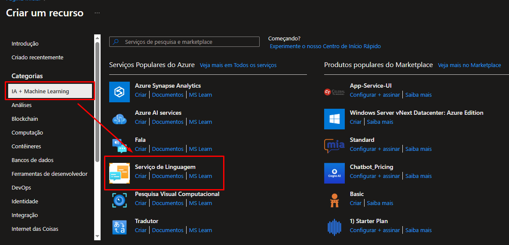
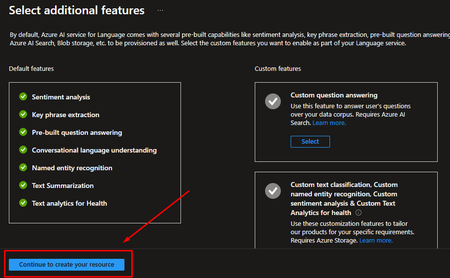
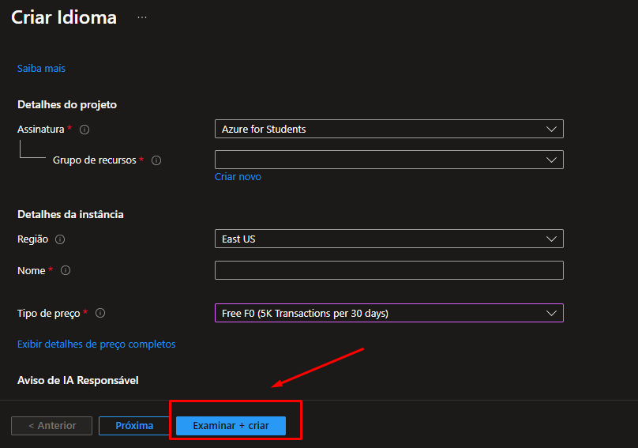
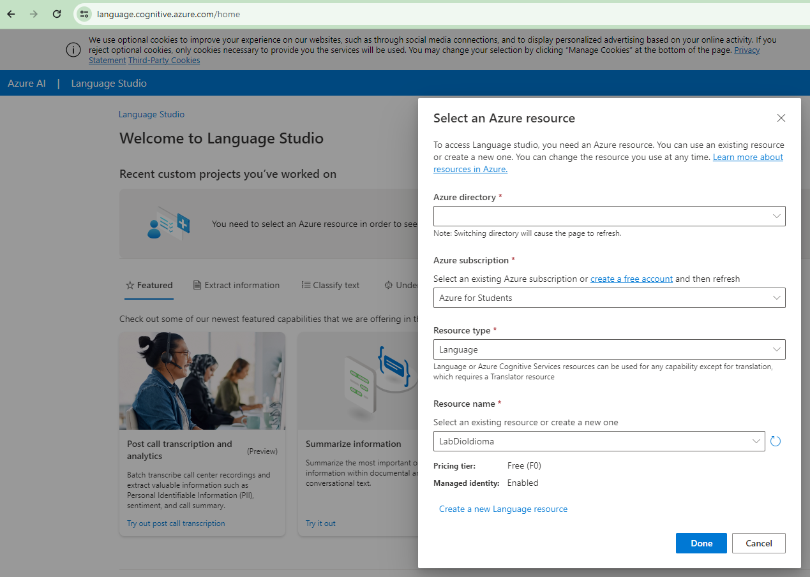
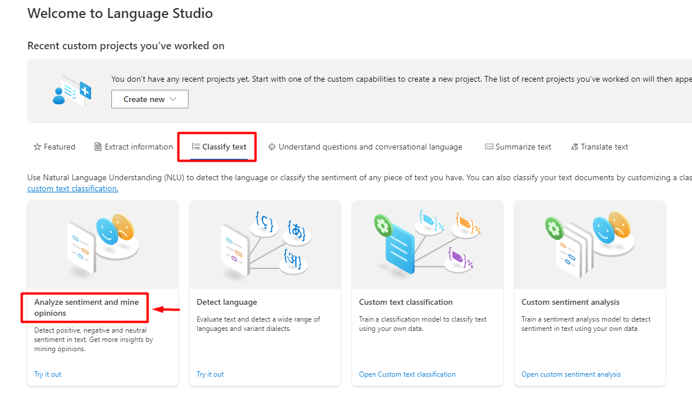
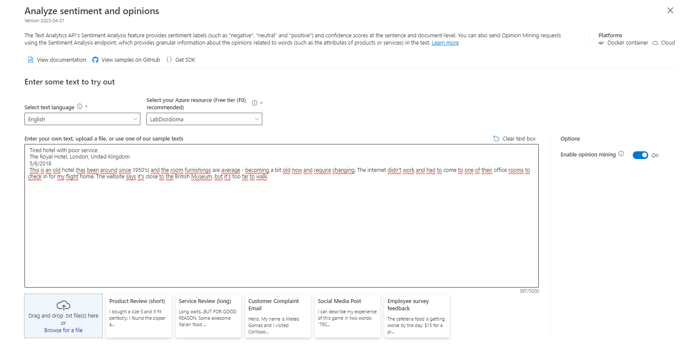
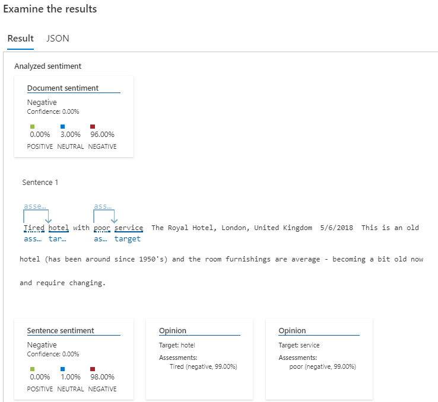
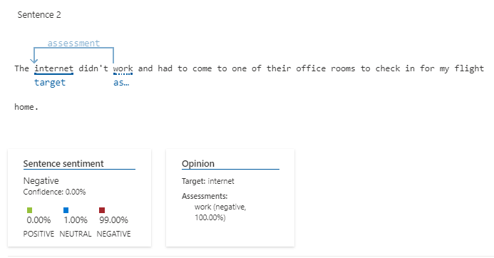
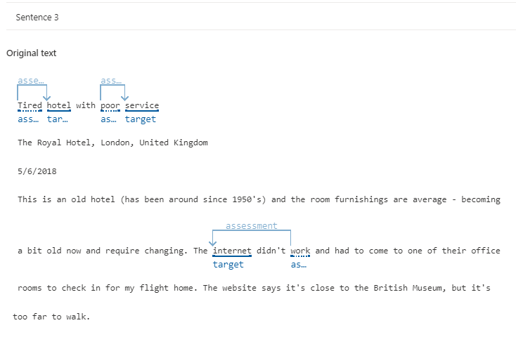

# Análise de Sentimentos com Language Studio no Azure AI

## Objetivo 🎯

Entrega do desafio DIO - Análise de Sentimentos com Language Studio no Azure AI

## Instruções (PT-BR)

1- Entre no portal do Azure usando https://portal.azure.com e acesse com suas credenciais da Microsoft.

2- Em "Criar um recurso" seleciona "IA + Machine Learning" e após em "Serviço de linguagem" clique em Criar

  

3- Selecione todas as features e clique em "Continue to create your resource"

  

4- Crie um recurso e preencha as informações necessárias, após clique em "Examinar + Criar" (esse passo pode demorar alguns minutos, aguarde a mensagem de sucesso)

Obs.: Caso ainda não possua um Grupo de recursos, basta clicar em "Criar novo" e criar um com título desejado

  

5 - Após criado com sucesso vá para https://language.cognitive.azure.com e acesse com suas credenciais da Microsoft.

6- Ao logar irá aparecer uma tela para preenchimento das informações. Caso o recurso do passo 4 tenha sido criado com sucesso, já será reconhecido como uma das opções.

  

7 -  Selecione "Classify text e após clique em "Analyze sentiment and mine opinions

  

8- Selecione a linguagem do texto, o recurso criado nos passos anteriores. Após, carregue o arquivo com texto que será examinado ou digite o texto desejado

  

9- Marque a caixa para ocnfirmar a demonstração e após clique em "Run"

  

10- Verifique a saída com resultado de cada frase

  
  
  

# Doc de Referência - Lab Microsoft

https://microsoftlearning.github.io/mslearn-ai-fundamentals/Instructions/Labs/09-speech.html

https://microsoftlearning.github.io/mslearn-ai-fundamentals/Instructions/Labs/06-text-analysis.html
